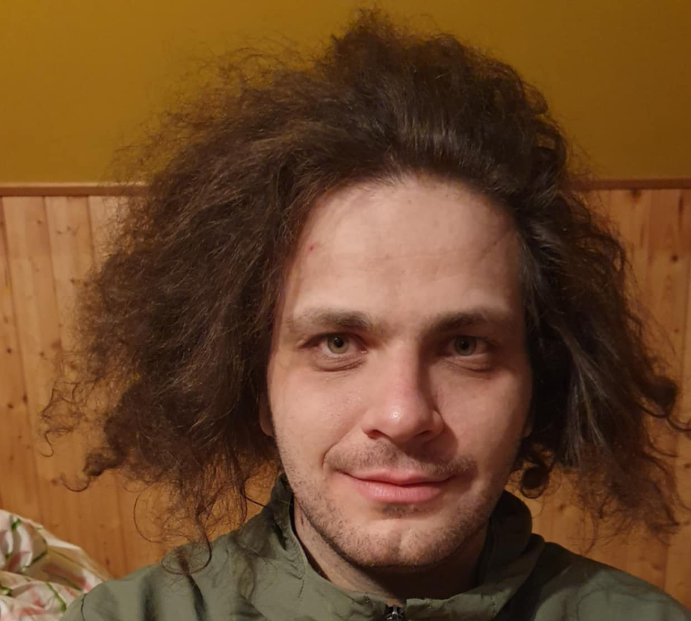

I am a quant in Second Foundation, Prague. I am broadly interested in theoretical aspects of machine learning, mainly:

- Concentration inequalities/sequences via betting
- Trustworthy machine learning
- Optimization

I completed my doctorate in Machine Learning at University of Tuebingen in 2025, advised by Matthias Hein. Prior to that, I have interned in Amazon research and  have received my Bachelor's ('19) and Master's ('21) degrees in computer science from Czech Technical University.
    
In my free time I like math, go, and heavy music.

